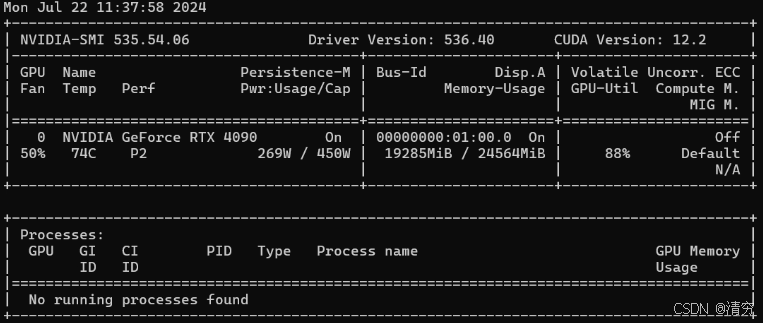
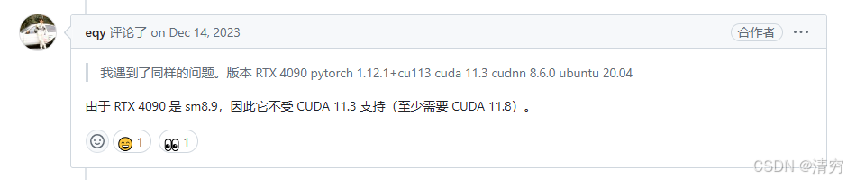
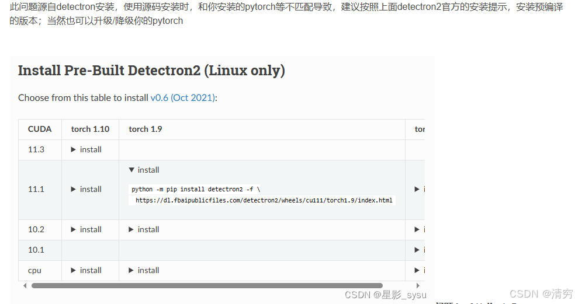

# Mask2Former环境配置解决


## 第一步 GitHub官方安装

贴一下官方安装链接：

[Mask2Former](https://github.com/facebookresearch/Mask2Former/blob/9b0651c6c1d5b3af2e6da0589b719c514ec0d69a/INSTALL.md)


如果设备（显卡）不是很新，可以先照着官方步骤进行安装。

如果对 CUDA 环境安装有疑问，可以参考我的另一篇博文：

[解决CUDA环境问题](https://blog.csdn.net/qq_43712324/article/details/135427738?spm=1001.2014.3001.5501)


接下来我就把我踩的坑一一讲述。


首先我的服务器显卡为 RTX 4090，下面是详细信息。

Windows 本机只有显卡驱动，没有安装 CUDA Toolkit。

训练使用的是 WSL2（Windows 子系统 Ubuntu 20.04）。




我经历了很多过程，首先是按照官方步骤进行安装，但是遇到了很多问题。

下面一一列举。

---

# 1. CUDA_HOME not Found


运行下面命令时：

```bash
cd mask2former/modeling/pixel_decoder/ops

sh make.sh
```


出现：

```text
CUDA_HOME not Found
```


因为本机没有安装 CUDA Toolkit，也没有配置环境变量，所以在编译时会提醒没有找到 CUDA。


我的解决方法是：

在当前 WSL2 子系统中安装 CUDA Toolkit。

（就是这个 CUDA 版本的问题令我苦恼了很久。）


如果所有安装工作都完成，运行训练代码出现下面问题：

```text
nvrtc: error: invalid value for --gpu-architecture (-arch)
```


那么可能就是 CUDA 版本和显卡架构不匹配。


因为我的服务器显卡比较新，所以 CUDA 版本存在兼容性问题。


下面贴出网上相关讨论：




参考链接：

https://github.com/pytorch/pytorch/issues/87595


所以之前做了很多无用功，不停安装 CUDA，但是一直出现各种问题。


最后安装：

```text
CUDA Toolkit 11.8
```

才成功完成配置。


个人认为：

首先需要明确机器上的 CUDA Toolkit 和环境中的 CUDA 是否匹配，不然很容易出现类似问题。


但是这种情况可能只针对当前项目。

（可能是因为 Mask2Former 需要 CUDA Toolkit 编译 CUDA Extension。）


以前做其他项目时，没有这么麻烦，只需要保证环境中的 CUDA 和官方提供的 CUDA 版本对应即可。

---

# 2. TypeError: __ init __() got an unexpected keyword argument 'dtype'


这个问题出现的情况比较有趣。

原因是：

```text
PyTorch版本
+
Detectron2版本
```

不兼容。


我尝试了好几种方法解决这个问题。

这些解决方法来自下面几个博客，我把链接贴出来，截图方便查看。





解决问题博客1：

[Mask2Former训练问题解决](https://blog.csdn.net/qq_41811902/article/details/134236417)


解决问题博客2：

[Mask2Former环境问题解决](https://blog.csdn.net/weixin_63293091/article/details/135187598)


---

还有其他问题，可以在上述博客中找到解决方法。

大多数都是单独包的版本兼容问题：

- 版本高了需要降低
- 版本低了需要升级


这篇文章写得比较乱，算是对我过去一周配置过程的一个总结。


我也不是很懂这些环境问题，但是非常感谢那些愿意分享解决方案的博主。


“开源模型是智商税”，我非常不同意这个说法。

没有广大愿意分享、交流、记录问题解决过程的人，又怎么能够拨云见日？


感谢所有愿意分享经验的开发者。